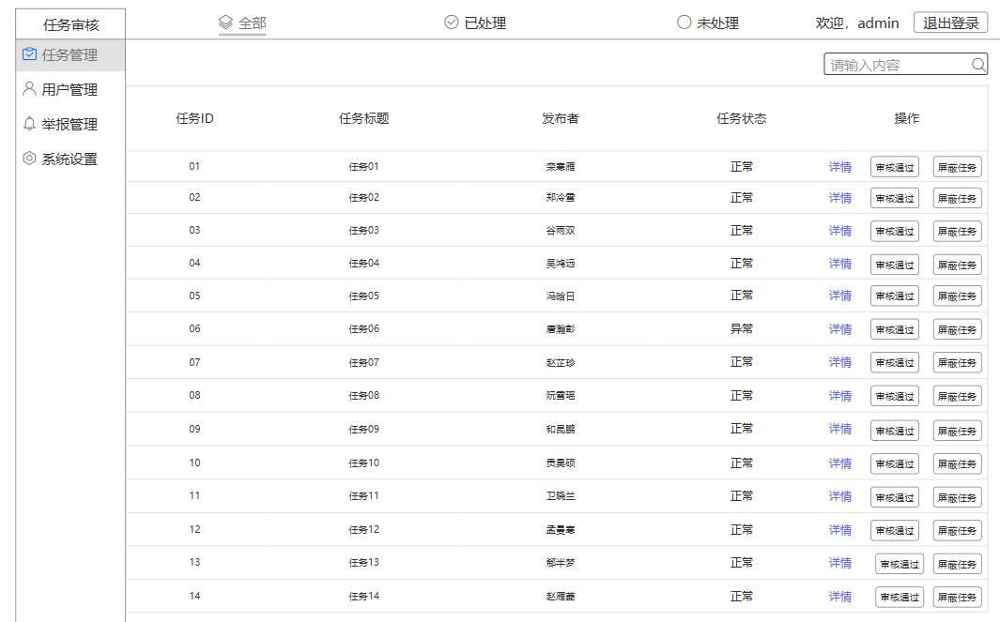
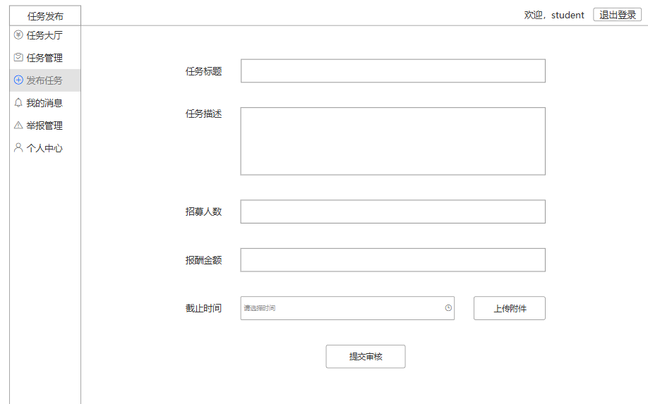
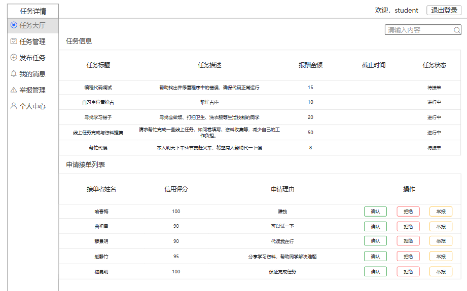
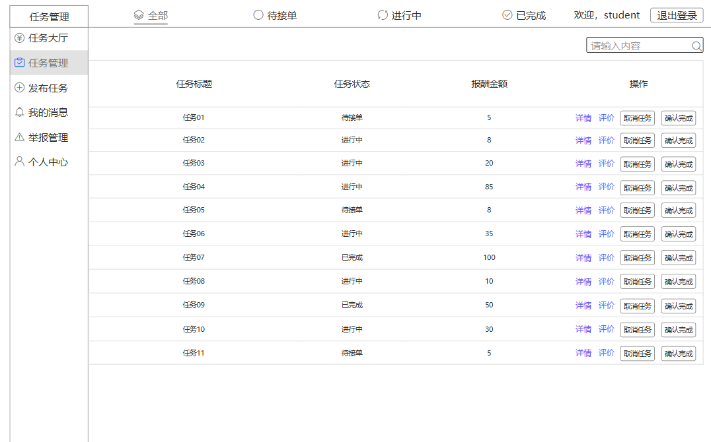
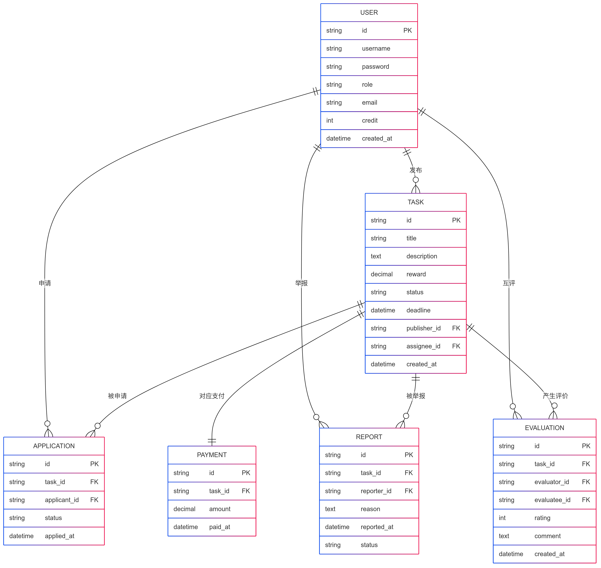

# 学生互助任务平台需求规格说明书

## 小组组号：第 1 组

## 小组成员成员：

### 谢俊羽 3222508239（组长）

### 陈祺雷 3222508240

### 王国伟 3222508220

### 林仕成 3222508204

### 郑伟健 3222508206

## 一、系统概述

### 1. 系统目标

开发一个基于 Spring Boot+MyBatis 的学生互助任务平台，提供任务发布、任务接单、用户交流和信用评价等功能，促进学生间的互助合作。

### 2. 用户角色

| 角色       | 权限说明                       |
| ---------- | ------------------------------ |
| **管理员** | 管理商品、用户、订单、统计分析 |
| **发布者** | 发布任务、选择接单人、确认完成 |
| **接单者** | 浏览任务、申请接单、提交成果   |
| **游客**   | 浏览任务、查看用户评价         |

---


## 二、功能需求

### 1. 后台管理页面

#### 功能模块

| 模块         | 功能描述                   | 优先级 |
| ------------ | -------------------------- | ------ |
| **任务管理** | 审核任务、处理违规任务     | 高     |
| **用户管理** | 查询用户、处理异常账号     | 中     |
| **举报管理** | 处理用户举报，屏蔽违规内容 | 高     |
| **统计分析** | 任务发布/完成情况统计      | 低     |

#### 示例图

```plaintext
[管理员示例图]
+-----------------+      +-----------------+
|     管理员       |      |     系统        |
+-----------------+      +-----------------+
| - 审核任务       |      | - 任务状态更新  |
| - 处理举报       |      | - 数据持久化    |
| - 统计分析       |      | - 生成报表      |
+-----------------+      +-----------------+
```

---

### 2. 用户使用页面

#### 功能模块

| 模块         | 功能描述                         | 优先级 |
| ------------ | -------------------------------- | ------ |
| **任务发布** | 填写任务详情、设置报酬、发布任务 | 高     |
| **任务接单** | 申请接单、发布者选择接单者       | 高     |
| **任务确认** | 接单者提交任务，发布者确认完成   | 高     |
| **支付报酬** | 任务完成，发布者支付报酬后       | 高      |
| **信用评价** | 任务完成后，双方互评             | 中     |


#### 用例图

```plaintext
[用户使用用例图]
+-----------------+      +-----------------+
|    发布者      |      |     系统        |
+-----------------+      +-----------------+
| - 发布任务      |      | - 任务存储      |
| - 选择接单者    |      | - 任务状态更新  |
| - 确认完成      |      | - 评价记录      |
| - 支付报酬      |      |                |
+-----------------+      +-----------------+

+-----------------+      +-----------------+
|    接单者      |      |     系统        |
+-----------------+      +-----------------+
| - 申请接单      |      | - 任务状态更新  |
| - 提交任务      |      | - 任务存储      |
| - 互评任务      |      | - 评价存储      |
+-----------------+      +-----------------+

```

---


## 三、界面原型设计

### 1. 后台管理界面

#### 任务审核页 (`adminTasks.html`)

- **布局**：顶部导航栏 + 左侧功能菜单 + 右侧表格
- **核心元素**：

  - 搜索框：按任务标题/发布者筛选
  - 操作按钮：`审核通过`、`屏蔽任务`
  - 表格列：任务 ID、标题、发布者、状态、操作





### 2. 用户使用界面

#### 任务发布页 (`postTask.html`)

- **布局**：输入任务标题、详情、报酬、截止时间
- **交互流程**：
  ```plaintext
  填写任务信息 → 确认发布 → 任务进入待接单状态
  ```



#### 任务详情页 (`taskDetail.html`)

- **布局**：任务信息 + 申请接单列表
- **交互流程**：  
  ```plaintext
  发布者查看接单申请 → 选择接单者 → 任务进入进行中状态
  ``` 



---

#### 任务管理页 (`myTasks.html`)

- **核心元素**：
- 显示任务状态: 待接单、进行中、已完成
- 操作按钮: 取消任务、确认完成、评价接单者
- **交互流程**：
  ```plaintext
  确认任务状态 → 完成任务/支付报酬
  ```



---

## 四、非功能需求

### 1. 性能需求

- 页面响应时间 ≤ 2 秒
- 支持并发用户数 ≥ 300

### 2. 安全性需求

- 用户密码加密存储
- 任务内容审核机制
- 定时自动释放无人应答的任务(超过15分钟)
- SQL 注入防护（MyBatis 参数绑定）
- 用户登录凭证使用JWT验证


---

## 五、验收标准

| 阶段       | 验收内容                       |
| ---------- | ------------------------------ |
| **数据库** | 任务、用户、评价表的 CRUD 测试 |
| **服务层** | 任务状态流转、接单逻辑测试     |
| **前端**   | 任务发布、接单、确认等功能测试 |

---

## 六、附录

1. **数据库 ER 图**


